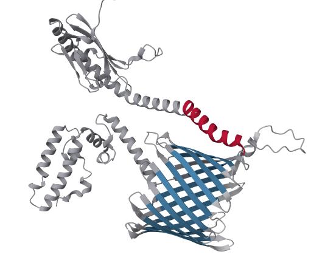

<!-- cSpell:ignore gkab gkac gkad -->
<div align="center">
  

# TMVisDB

</div>

A database for searching and visualizing predicted transmembrane proteins with their AlphaFold structures. :seal:

## Overview

TMvisDB provides per-residue transmembrane topology annotations for all proteins in [AlphaFold DB](https://alphafold.com/) (~ 200 million proteins, September '22) predicted as transmembrane proteins (~ 46 million). The annotations are predicted using TMbed and visualized by overlaying them with AlphaFold 2 structures.

The web interface is accessible [here](https://tmvisdb.predictprotein.org)

## Preview



<details>
  <summary markdown="span">
  Figure caption
  </summary>

**3D structure and membrane topology visualization protein DnaJ homolog subfamily C member 11 (Q9NVH1).** The protein DnaJ with per-residue topology color-scheme: inside-to-outside TMH (light red), outside-to-inside TMH (dark red), inside-to-outside TMB (light blue), outside-to-inside TMB (dark blue),other (grey). The length of the alpha-helix and beta-barrel could align with membrane boundaries.

</details>

## Features

- **Protein Search**: Search for specific proteins using UniProt identifiers
- **Advanced Filtering**: Filter proteins by:
  - Transmembrane topology (alpha-helix, beta-strand)
  - Signal peptide presence
  - Taxonomy (UniProt Organism ID, Domain, Kingdom)
  - Protein length
- **3D Visualization**: Interactive visualization of:
  - Protein structures from AlphaFold DB
  - Transmembrane topology annotations
  - pLDDT confidence scores
- **Multiple Data Sources**: Integration with:
  - TMbed predictions
  - AlphaFold DB structures (~200M proteins)
  - UniProt annotations
  - TopDB experimental data
  - TMAlphaFold annotations
  - Membranome annotations
  - LambdaPP protein-specific phenotype predictions
  - Foldseek structural alignments

## Technology Stack

### Frontend

- SvelteKit
- TanStack Query
- Skeleton UI
- TypeScript

### Backend

- FastAPI
- SQLModel
- Python 3.12+
- SQLite

## Development

### Prerequisites

- Node.js
- Python 3.12+
- pnpm (recommended)

### Setup

1. Clone the repository:

   ```bash
   git clone https://github.com/t03i/tmvisdb.git
   cd tmvisdb
   ```

2. Install frontend dependencies:

   ```bash
   cd frontend
   pnpm install
   ```

3. Start the development server:

   Frontend:

   ```bash
   cd frontend
   pnpm dev
   ```

   Backend:

   ```bash
   docker compose -f docker-compose.yaml -f docker-compose.dev.yaml up -d
   ```

### Database Schema


## Citations

If you use TMvisDB in your research, please cite:

```bibtex
@article{tmvisdb2024,
title={TMvisDB: A database for visualization of predicted transmembrane proteins},
author={...},
journal={bioRxiv},
year={2022},
doi={10.1101/2022.11.30.518551}
}
```

For predicted annotations in the database:

- **TMbed**: [DOI: 10.1186/s12859-022-04873-x](https://doi.org/10.1186/s12859-022-04873-x)

For structures:

- **AlphaFold DB**: [DOI: 10.1093/nar/gkab1061](https://doi.org/10.1093/nar/gkab1061)
- **AlphaFold**: [DOI: 10.1038/s41586-021-03819-2](https://doi.org/10.1038/s41586-021-03819-2)

Additional tools and resources:

- **Membranome**:
  - [DOI: 10.1093/nar/gkw712](https://doi.org/10.1093/nar/gkw712)
  - [DOI: 10.1093/bioinformatics/btx720](https://doi.org/10.1093/bioinformatics/btx720)
  - [Website: https://membranome.org/](https://membranome.org/)
- **TMAlphaFold**:
  - [DOI: 10.1093/nar/gkac928](https://doi.org/10.1093/nar/gkac928)
  - [Website: https://tmalphafold.ttk.hu/](https://tmalphafold.ttk.hu/)
- **TopDB**:
  - [DOI: 10.1093/nar/gkad897](https://doi.org/10.1093/nar/gkad897)
  - [DOI: 10.1093/nar/gku1119](https://doi.org/10.1093/nar/gku1119)
  - [DOI: 10.1093/nar/gkm751](https://doi.org/10.1093/nar/gkm751)
  - [Website: http://topdb.enzim.hu/](http://topdb.enzim.hu/)
- **Uniprot**:
  - [DOI: 10.1093/nar/gkac1052](https://doi.org/10.1093/nar/gkac1052)
  - [Website: https://www.uniprot.org/](https://www.uniprot.org/)

## License

Apache-2.0 License - see [LICENSE](LICENSE.txt) for details

## Resources

- [Issue Tracker](https://github.com/t03i/tmvisdb/issues)
- [Discussions](https://github.com/t03i/tmvisdb/discussions)
- [Code of Conduct](CODE_OF_CONDUCT.md)

## Acknowledgments

Developed and maintained at [Rostlab](https://rostlab.org)
